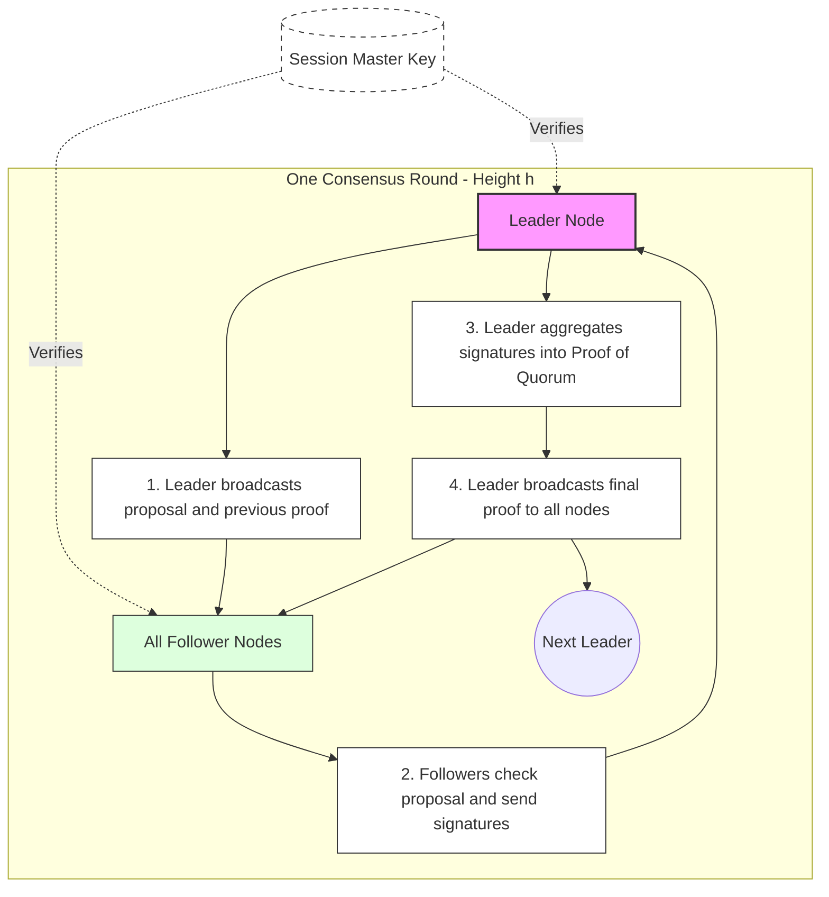

# RFC: `Decisive` Protocol Specification

**Version:** 0.0.1

---

## 1. Abstract
`Decisive` is a distributed consensus protocol designed for deterministic agreement in trusted clusters of up to a thousand nodes. Unlike Paxos or Raft, `Decisive` focuses on generating compact cryptographic **Proofs of Quorum** using [BLS12-381](https://datatracker.ietf.org/doc/draft-irtf-cfrg-pairing-friendly-curves/08/). It serves as a high-performance primitive for metadata coordination and distributed control planes.

---

## 2. Architecture & Lifecycle
The system decouples the long-term trust anchor from operational rounds:
* **Session (Long-term):** Established via a trusted setup (VSS/DKG). It defines membership, the `SessionID`, and the public polynomial commitments ($A_k$).
* **Round (Ephemeral):** A single consensus instance for a specific proposal (height).
* **Root of Trust:** Nodes must verify the Master Public Key ($P_{pk}$) and commitments ($A_k$) before participating. Any change in membership requires the initiation of a new session.

---

## 3. Cryptographic Stack
The protocol utilizes Threshold BLS (T-BLS) to enable constant-size certificates regardless of the participant count.

### 3.1. Curve Parameters
| Component | Field | Size | Role |
| :--- | :--- | :--- | :--- |
| **Private Share ($s_i$)** | $\mathbb{F}_r$ | 32B | Node's secret: $s_i = f(i) \pmod r$ |
| **Partial Signature ($\sigma_i$)** | $\mathbb{G}_1$ | 48B | Individual signature: $\sigma_i = s_i \cdot H(m)$ |
| **Commitments ($A_k$)** | $\mathbb{G}_2$ | 96B | Public polynomial coefficients: $A_k = a_k \cdot g_2$ |
| **Master Public Key ($P_{pk}$)** | $\mathbb{G}_2$ | 96B | Cluster root key ($A_0$), used for final verification |

### 3.2. Verifiable Secret Sharing (VSS) & Binding

#### 3.2.1. Derivation of Share Public Keys
The Leader derives each node's individual public key $P_i \in \mathbb{G}_2$ locally by evaluating the polynomial in the exponent:

$$P_i = \sum_{j=0}^{k} (i^j \pmod r) \cdot A_j$$

This operation uses Multi-Scalar Multiplication (MSM). The exponentiation $i^j$ is performed in the scalar field $\mathbb{F}_r$, while the summation $\sum$ occurs in the group $\mathbb{G}_2$.

#### 3.2.2. Contextual Binding
To prevent replay and malleability attacks, the message $m$ is bound to the context using `BLAKE3` in keyed mode:

$$
\text{session}_{id} = \text{BLAKE3}\Big(\text{Key} = \text{DST}_{\text{SESS}}, \text{Data} = \text{nodes}_{list} \parallel \text{public}_{commitments}\Big)
$$

$$
m = \text{BLAKE3}\Big(\text{Key} = \text{DST}_{\text{SIG}}, \text{Data} = \text{session}_{id} \parallel \text{height} \parallel \text{payload}_{hash}\Big)
$$

The mapping $H(m) \in \mathbb{G}_1$ complies with [RFC 9380](https://www.rfc-editor.org/rfc/rfc9380.html) (Suite: `BLS12381G1_XMD:BLAKE3_SSWU_RO_`).

#### 3.2.3. Verification Equations
**Partial Signature:** $e(\sigma_i, g_2) = e(H(m), P_i)$

**Aggregate Proof of Quorum:** $e(\Sigma, g_2) = e(H(m), P_{pk})$

### 3.2.4. Threshold Definition
For a cluster of $n$ nodes with $f$ potential Byzantine faults:
* **Security (Safety):** Polynomial degree $k = f$. (Ensures $f$ malicious actors cannot forge a signature).
* **Liveness (Quorum):** Quorum threshold $t = 2f + 1$.
* **Constraint:** $n \ge 3f + 1$.

---

## 4. Network Specification
The protocol operates over IPv6/QUIC. The packet includes a `NodeID` for rapid public key identification.

### 4.5. Packet Structure (123 Bytes)
| Offset | Length | Field | Go Type | Description |
| :----- | :----- | :------------ | :--------- | :------------------------------------ |
| 0 | 1 | `Version` | `uint8` | Protocol version `0x01` |
| 1 | 1 | `NodeID` | `uint8` | Sender index $i \in [0, n-1]$ |
| 2 | 32 | `SessionID` | `[32]byte` | BLAKE3 session metadata hash |
| 34 | 8 | `Height` | `uint64` | Monotonic round height |
| 42 | 32 | `Payload` | `[32]byte` | BLAKE3 payload hash |
| 74 | 48 | `Signature` | `[48]byte` | Compressed $\mathbb{G}_1$ point |

---

## 5. Distributed State Machine

### 5.1. Leader Election & Entropy
The leader for height $h$ is determined deterministically:
1.  **Primary Path:** $L_h = \text{BLAKE3}(\Sigma_{h-1}) \pmod n$.
2.  **Fallback (View Change):** If no quorum is reached within timeout $T$, $L_h = (h + \text{attempt}) \pmod n$.

### 5.2. Transition Lifecycle
1.  **Propose:** $L_h$ broadcasts the `Payload` and the previous proof $\Sigma_{h-1}$.
2.  **Attest:** Nodes verify $L_h$ and $\Sigma_{h-1}$, then send their partial signature $\sigma_i$.
3.  **Finalize:** The Leader aggregates $t$ signatures into $\Sigma_h$ and proceeds to $h+1$.

#### Protocol Flow Diagram

---

## 6. Constraints & Sync

### 6.1. State Synchronization
Nodes in "catch-up" mode must verify the chain of $\Sigma_h$ sequentially. To optimize, the implementation should support periodic snapshot signatures (`DST_SNAP`).